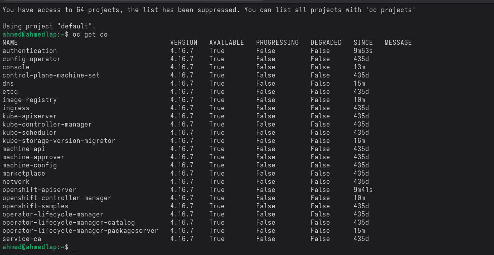

# OpenShift Local (CRC) Setup Guide

## 1. Prerequisites
- Linux system with virtualization enabled (Intel VT-x / AMD-V)
- At least 6 CPU cores and 16 GB RAM recommended
- libvirt and NetworkManager installed and running
- Pull secret downloaded from: https://console.redhat.com/openshift/downloads

## 2. Verify CPU Virtualization Support
```bash
egrep -c '(vmx|svm)' /proc/cpuinfo
```

## 3. Install virtualization packages (libvirt / qemu)
```bash
sudo dnf install qemu-kvm libvirt-daemon libvirt-daemon-config-network virt-manager -y
sudo systemctl enable --now libvirtd
sudo usermod -aG libvirt $(whoami)
newgrp libvirt
virsh list --all
```

## 4. Download CRC
```bash
wget https://developers.redhat.com/content-gateway/file/pub/openshift-v4/clients/crc/2.41.0/crc-linux-amd64.tar.xz
tar -xvf crc-linux-amd64.tar.xz
sudo mv crc-linux-2.41.0-amd64/crc /usr/local/bin/
crc version
```

## 5. Download & Move the Pull Secret and Rename

# Pull Secret

To get your pull secret for OpenShift Local (CRC), visit:

https://console.redhat.com/openshift/create/local

> Log in with your Red Hat Developer account and copy the JSON pull secret to a file on your system (e.g., ~/Downloads/pull-secret.txt).


```bash
mv ~/Downloads/pull-secret ~/Downloads/pull-secret.txt
```

## 6. Configure CRC Resources
```bash
crc config set memory 16384
crc config set cpus 6
crc config set disk-size 100
crc config set pull-secret-file ~/Downloads/pull-secret.txt
crc config set consent-telemetry no
```

## 7. Run Initial Setup
```bash
crc setup
```

## 8. Start the Cluster
```bash
crc start -p ~/Downloads/pull-secret.txt
```

## 9. Download OC cli to avoid using eval $(crc oc-env) On every Crc Startup
```bash
eval $(crc oc-env)
###*** Download oc cli to avoid using eval $(crc oc-env) everytime after starting crc ***###
curl -LO https://mirror.openshift.com/pub/openshift-v4/clients/ocp/latest/openshift-client-linux.tar.gz
tar -xvf openshift-client-linux.tar.gz
sudo mv oc kubectl /usr/local/bin/
###
oc login -u kubeadmin -p <password-shown-after-start> https://api.crc.testing:6443
```

## 10. Web Console
Open in browser:
```
https://console-openshift-console.apps-crc.testing
```
## to install from local crc

$ crc start -p ~/Downloads/pull-secret.txt  -b crc_libvirt_4.16.7_amd64.crcbundle

## Finally verify that all OC components Running


